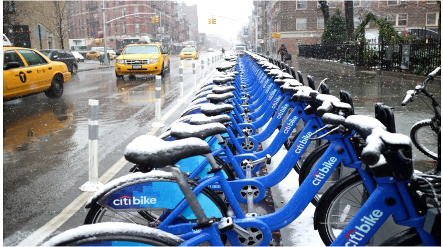
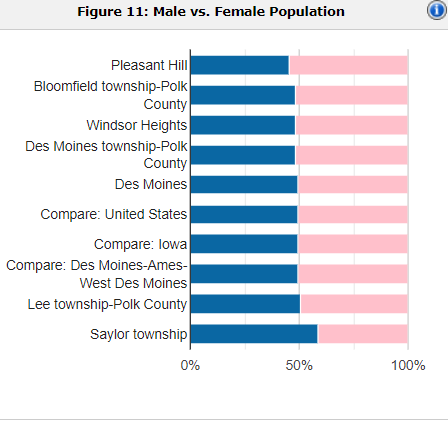
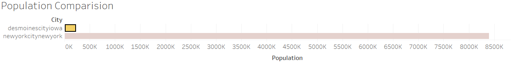
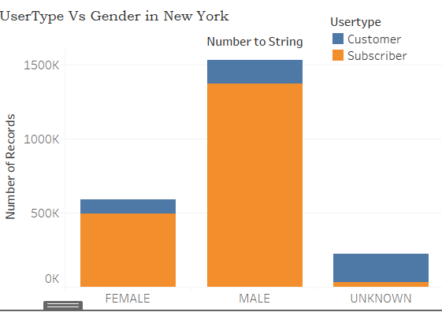
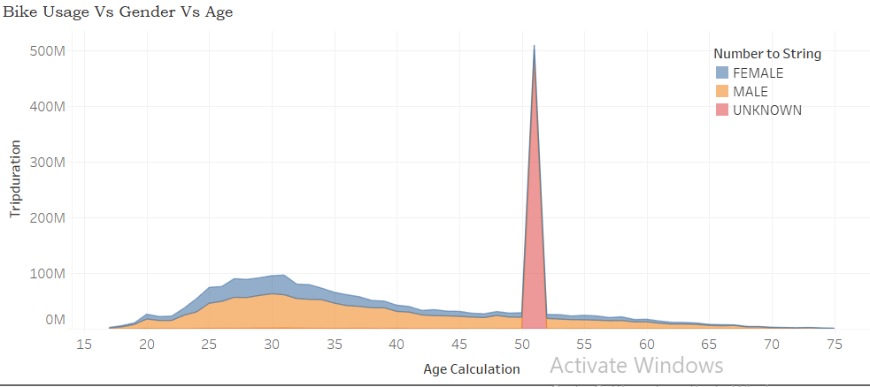
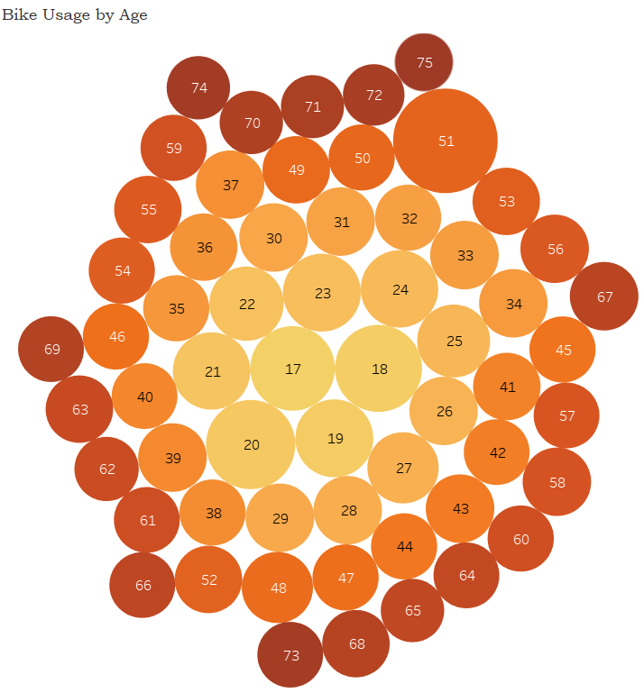
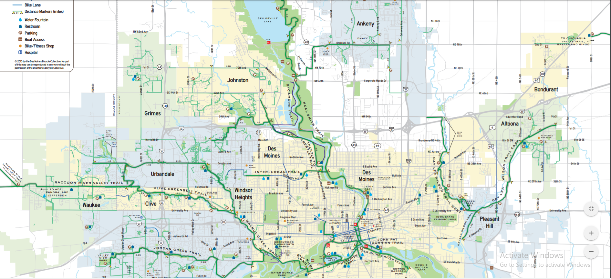

# NYC Citi Bike  and Des Moines Analysis

An analysis for the New York Citi Bike Program, which responsible for overseeing the largest bike sharing program for 200,000+ data points in the United States was done in order to generate business insights and visualize similar kind of bike sharing program in Des Moines Iowa.

## Resources
- Data Source: 
  1. [Citibike Data](https://www.citibikenyc.com/system-data "Citibike Data")
  2. [Des Moines Census](https://www.census.gov/quickfacts/desmoinescityiowa "Des Moines Census")
  3. [Des Moines Tourisim Website](https://www.catchdesmoines.com/things-to-do/ "Des Moines Tourisim Website")
- Software: Tablaeu .
 ## Link to the complete Dashboard and story point :
Complete link to the dashboard and story point is given below.
[BikeShare Dashborad](https://public.tableau.com/profile/varsha.jha#!/vizhome/BikeShare_Challenge/NYCBikeShareData "BikeShare Dashborad")
[Des Moines Story](https://public.tableau.com/profile/varsha.jha#!/vizhome/BikeShare_Challenge/DesMoines "Des Moines Story")

## Findings:
**The gender diversity in the Des Moines is almost 50.2 %.**

**The gender diversity in the Des Moines is almost similar to that of New York population.**

The population comparison between the two cities shows a significant difference . However the gender diversity is still the same between two cities .

**The gender diversity does not have any effect on the proposed business plan**

The graph below shows that gender diversity does not have any affect on the number of bike users who are single time user/customer or annual subscriber. The below graph shows that the ratio of single time user and annual subscriber (10:1) is alomst the same in both male and female.

The graph below shows the bike usage based on the age and gender. The graph shows that both the genders have similar usage of the bike irrespective of the gender.

## Other Factors to be considered.
The analysis however did show that age group of the population should be considered as a factor and also the basic bike infrastructure maintained by local administration.

Bike trails available and maintianed by the city administration.

